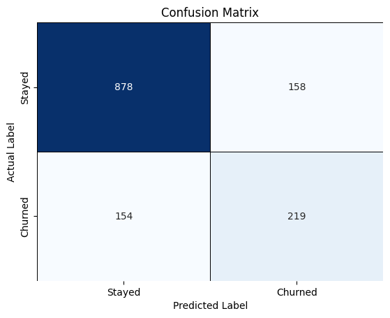

# 📊 Customer Churn Prediction using Machine Learning

> Built an end-to-end customer churn prediction pipeline using Random Forest and SMOTE to identify customers at risk of leaving and derive actionable business insights for improving customer retention.


---

## 🎯 Problem Statement

Customer churn directly impacts revenue and growth in telecom businesses. This project aims to predict whether a customer is likely to churn and uncover the factors responsible for customer attrition, enabling proactive retention strategies.

---

## 🚀 Project Highlights

- ✅ Performed data cleaning and preprocessing.
- ✅ Conducted Exploratory Data Analysis (EDA).
- ✅ Handled class imbalance using SMOTE.
- ✅ Trained a Random Forest Classifier.
- ✅ Evaluated model performance using multiple metrics.
- ✅ Visualized results using Confusion Matrix and ROC Curve.
- ✅ Identified important features driving customer churn.
- ✅ Generated business recommendations to improve retention.

---

## 📊 Model Performance

| Metric | Score |
|----------|--------|
| Accuracy | **77.86%** |
| Precision | **0.58** |
| Recall | **0.59** |
| F1-Score | **0.58** |
| Weighted F1-Score | **0.78** |

The model effectively classifies customer churn and provides meaningful insights that can help businesses target customers at risk of leaving.

---

## 📈 Visualizations

### Confusion Matrix

The confusion matrix provides a detailed view of the model's classification performance.



---

### ROC Curve and AUC Score

The ROC curve illustrates the trade-off between the True Positive Rate and False Positive Rate, while the AUC score measures the model's ability to distinguish between churn and non-churn customers.


---

### Top 10 Important Features

Feature importance analysis highlights the variables that have the greatest impact on customer churn prediction.


---

## ⚙️ Machine Learning Pipeline

```text
Raw Data
    ↓
Data Cleaning
    ↓
Exploratory Data Analysis
    ↓
Feature Encoding
    ↓
Train-Test Split
    ↓
SMOTE
    ↓
Random Forest Training
    ↓
Model Evaluation
    ↓
Confusion Matrix
    ↓
ROC Curve
    ↓
Feature Importance
    ↓
Business Insights
```

---

## 🛠 Tech Stack

| Category | Tools |
|------------|--------|
| Language | Python |
| Data Analysis | Pandas, NumPy |
| Visualization | Matplotlib, Seaborn |
| Machine Learning | Scikit-Learn |
| Imbalance Handling | SMOTE |
| Model | Random Forest Classifier |
| Environment | Jupyter Notebook |

---

## 🔍 Key Findings

- Customers with month-to-month contracts exhibit higher churn rates.
- Customers with high monthly charges are more likely to leave.
- Customers with shorter tenure are at greater risk of churn.
- Long-term contracts significantly improve customer retention.
- Total charges and tenure are among the strongest indicators of customer loyalty.

---

## 💡 Business Recommendations

- Encourage customers to switch to annual or long-term contracts.
- Target newly acquired customers with retention campaigns.
- Provide incentives to customers with high monthly charges.
- Introduce loyalty programs to increase customer tenure.
- Use predictive analytics to identify high-risk customers early.

---

## 📈 Visualizations Included

- Churn Distribution
- Contract Type vs Churn
- Monthly Charges Analysis
- Total Charges Analysis
- Correlation Heatmap
- Feature Importance Plot
- Confusion Matrix
- ROC Curve

---

## 📂 Repository Structure

```text
Customer-Churn-Prediction
│
├── Customer_Churn_ML_final.ipynb           # End-to-end ML pipeline
├── WA_Fn-UseC_-Telco-Customer-Churn.csv    # Telecom customer dataset
├── requirements.txt                        # Project dependencies
├── README.md                               # Project documentation
├── .gitignore                              # Ignore unnecessary files
│
└── Images/
    ├── confusion_matrix.png                # Confusion Matrix
    ├── ROC_curve and AUC score.png         # ROC Curve and AUC Analysis
    └── Top 10 imp features.png             # Top 10 Important Features
```

---

## 🚀 Future Improvements

- Hyperparameter tuning using GridSearchCV.
- Compare Random Forest with XGBoost and LightGBM.
- Deploy the model using Streamlit.
- Add explainability using SHAP values.
- Build an interactive dashboard.

---

## ⭐ Project Outcome

Developed an end-to-end machine learning solution capable of predicting customer churn with **77.86% accuracy**, while generating actionable insights that can help telecom companies reduce customer attrition and improve retention strategies.

---

## 📬 Contact

**Apoorva Shree**

---

### ⭐ If you found this project useful, feel free to star the repository!
